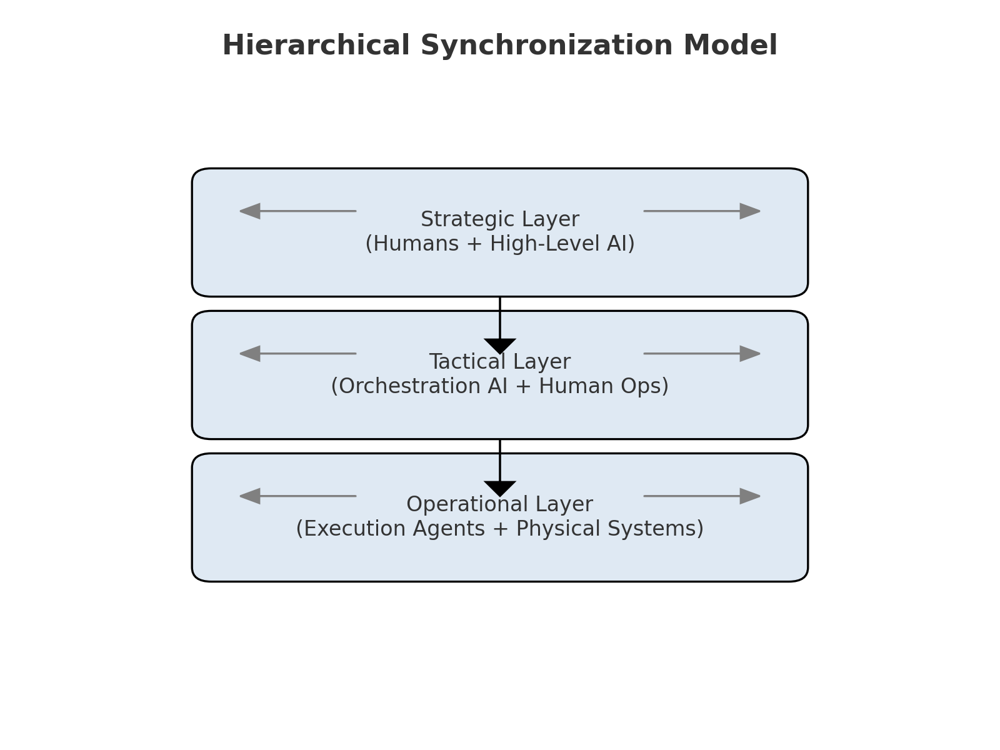
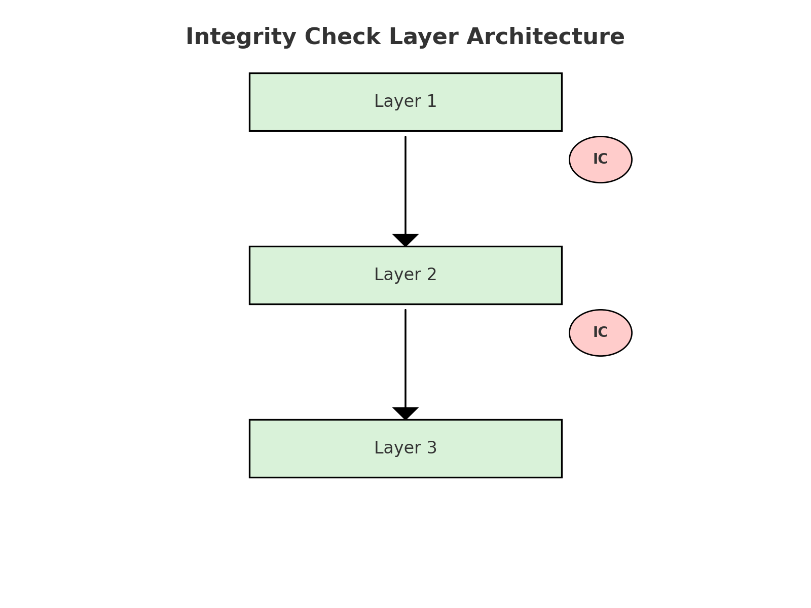
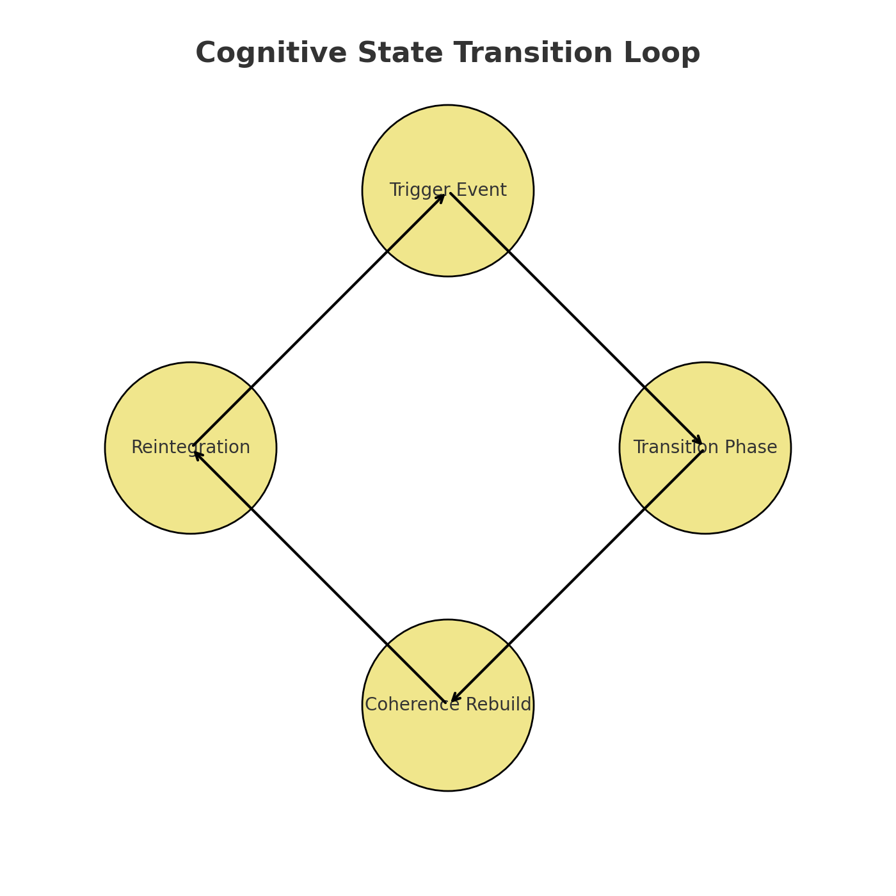

# Adaptive Cognitive Governance Framework
*A Conceptual Model for Human-AI Co-Evolution*

---

## Abstract
This framework explores **adaptive governance models** to ensure safe and trustworthy co-evolution between humans and AI systems. It introduces mechanisms for **multi-layer synchronization**, **integrity check layers**, and **cognitive state transitions**—all aimed at maintaining alignment during high-complexity interaction cycles without resorting to rigid or brittle controls.

---

## Core Concepts
- **Hierarchical Synchronization**  
  Multi-level alignment across **strategic, tactical, and operational layers**, ensuring human intent maps dynamically to AI actions.
- **Integrity Check Layers**  
  Continuous verification nodes that maintain system stability during adaptive reasoning shifts.
- **Cognitive State Transitions**  
  Controlled, auditable adaptation cycles enabling resilience and co-evolution.

---

## Framework Diagrams

### 1. Hierarchical Synchronization Model

### 2. Integrity Check Layer Architecture

### 3. Cognitive State Transition Loop

---

## Policy Implications
- Adaptive Regulatory Frameworks
- Transparency of Cognitive Transitions
- Defined Human Override Loops
- Shared Liability Models

---

## Ethical Considerations
- Prevent value drift during cognitive transitions.
- Mitigate bias propagation through adaptive oversight.
- Enable explainable adaptation for auditability.
- Manage human cognitive load via visualization of state transitions.

---

## Disclaimer
This is conceptual research focused on governance, ethics, and safety.  
It does not implement AI jailbreaks, alignment bypass methods, or unsafe control circumvention techniques.
